<!-- <p align="center">
  
</p> -->

<h1 align="center">🛡️ StockShield Protocol</h1>

<p align="center">
  <strong>The LP Protection Layer for the Tokenized Securities Era</strong>
</p>

<p align="center">
  <a href="#features"></a>
  <a href="#architecture"></a>
  <a href="#contracts"></a>
  <a href="LICENSE"></a>
</p>

<p align="center">
  <a href="#-the-problem">Problem</a> •
  <a href="#-the-solution">Solution</a> •
  <a href="#-architecture">Architecture</a> •
  <a href="#-quick-start">Quick Start</a> •
  <a href="#-documentation">Docs</a>
</p>

---

## 📖 Overview

**StockShield** (also known as **AURA Protocol**) is a cutting-edge Uniswap v4 Hook designed to protect liquidity providers in **tokenized securities pools** from two critical attack vectors:

1. **⏰ Session Boundary Gaps** — Price divergence during market closures (nights, weekends, holidays)
2. **📊 Continuous LVR** — Loss-versus-rebalancing during trading hours

> *"We're not building another LVR solution. We're building the LP protection layer for the tokenized securities era."*

---

## 🚨 The Problem

### Two Worlds Colliding

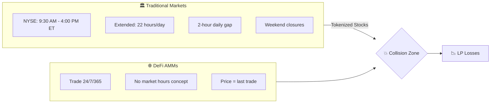

### The Gap Attack Scenario

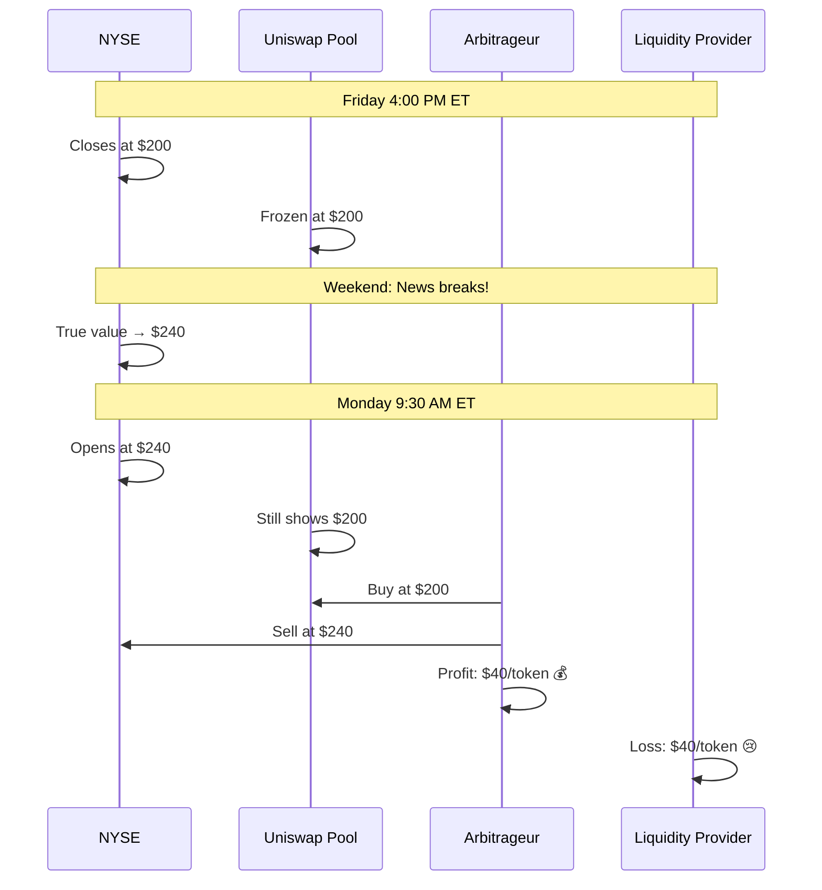

### Historical Gap Data (2024)

| 📅 Weekend Event | 📊 Gap Size |
|-----------------|-------------|
| Apple Earnings (July) | **+11.4%** |
| Fed Rate Surprise (March) | **-9.5%** |
| Geopolitical Event (Oct) | **-9.0%** |
| *Average Weekend Gap* | *±3.2%* |

> **Impact**: At 3% avg gap × 70% arbitrage capture × 52 weekends × billions in TVL = **Hundreds of millions in annual LP losses**

---

## 💡 The Solution

StockShield implements **dual-mode protection** through a unified auction architecture:

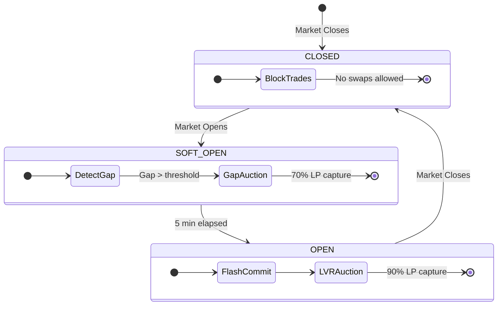

### Mode 1: Session Boundary Protection (SOFT_OPEN)

When NYSE transitions from CLOSED → OPEN:

```
┌─────────────────────────────────────────────────────────────┐
│                    GAP AUCTION FLOW                         │
├─────────────────────────────────────────────────────────────┤
│                                                             │
│   Pyth Oracle: Real Price = $240                           │
│   Pool Price: $200                                          │
│   Gap: 20%                                                  │
│                                                             │
│   ┌─────────────────────────────────────────────────────┐  │
│   │ MINIMUM BID DECAY SCHEDULE                           │  │
│   ├─────────────────────────────────────────────────────┤  │
│   │ Minute 0:  ██████████████████████████████  70%       │  │
│   │ Minute 1:  ████████████████████████        56%       │  │
│   │ Minute 2:  ██████████████████              42%       │  │
│   │ Minute 3:  ████████████                    28%       │  │
│   │ Minute 4:  ██████                          14%       │  │
│   │ Minute 5+: Normal Flash-Commit Mode        ──        │  │
│   └─────────────────────────────────────────────────────┘  │
│                                                             │
│   Winner bids $35 → LP captures $35 of $40 gap (87.5%)     │
└─────────────────────────────────────────────────────────────┘
```

### Mode 2: Continuous LVR Protection (OPEN)

During trading hours, Flash-Commit auctions run every block:

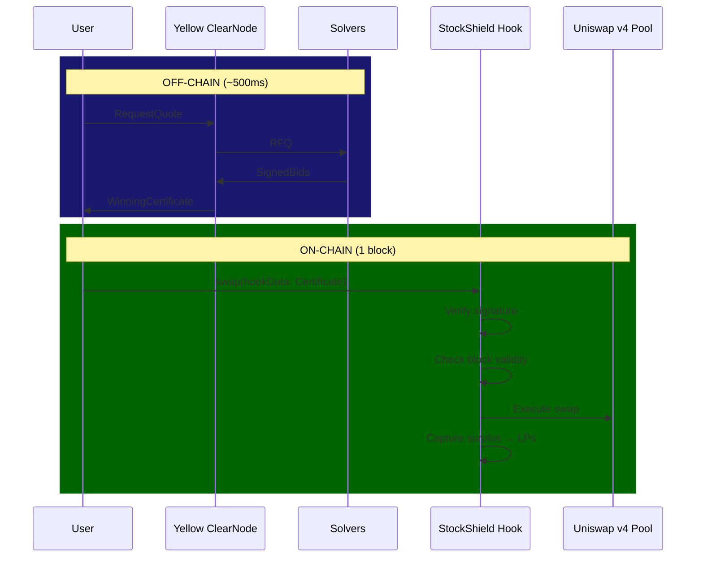

---

## 🏗️ Architecture

### System Overview

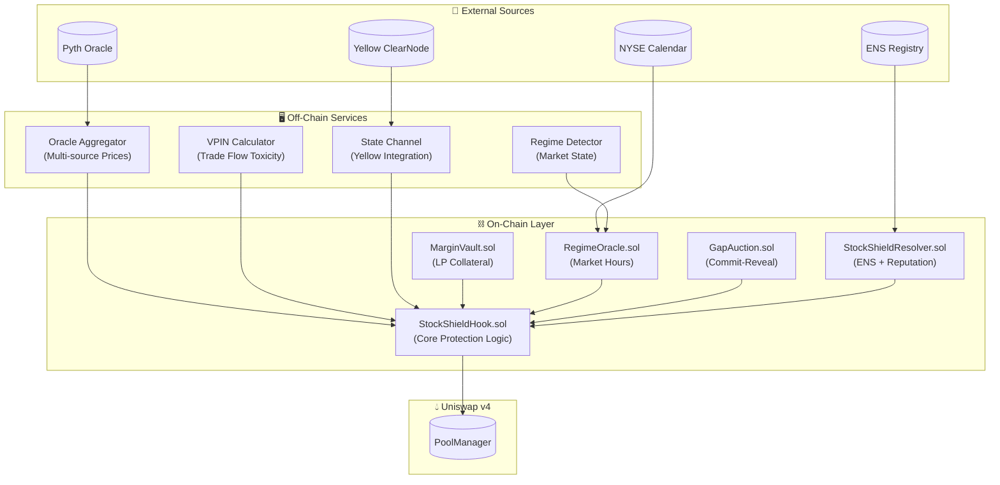

### Smart Contract Architecture

```
contracts/
├── src/
│   ├── StockShieldHook.sol      ⟵ Core Uniswap v4 hook (CRITICAL)
│   ├── MarginVault.sol          ⟵ LP collateral + state channels (HIGH)
│   ├── RegimeOracle.sol         ⟵ Market hours detection (HIGH)
│   ├── GapAuction.sol           ⟵ Commit-reveal gap auction (MEDIUM)
│   └── StockShieldResolver.sol  ⟵ ENS resolver + reputation (MEDIUM)
├── test/
│   └── *.t.sol                  ⟵ Foundry tests
├── script/
│   └── Deploy.s.sol             ⟵ Deployment scripts
└── foundry.toml
```

### Market Regime State Machine

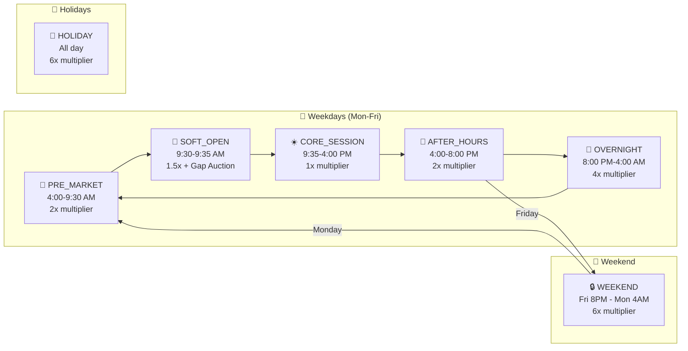

---

## 📊 Fee Parameters

| Regime | Base Fee (f₀) | Multiplier (R) | Max Fee |
|--------|:-------------:|:--------------:|:-------:|
| **CORE_SESSION** | 5 bps | 1.0x | 50 bps |
| **SOFT_OPEN** | 10 bps | 1.5x | 75 bps |
| **PRE_MARKET** | 15 bps | 2.0x | 100 bps |
| **AFTER_HOURS** | 15 bps | 2.0x | 100 bps |
| **OVERNIGHT** | 30 bps | 4.0x | 300 bps |
| **WEEKEND** | 50 bps | 6.0x | 500 bps |
| **HOLIDAY** | 50 bps | 6.0x | 500 bps |

### Dynamic Fee Formula

```
fee = f₀ + α×σ² + β×VPIN + γ×R×(σ² + VPIN) + δ×|I|
```

Where:

- **f₀** = Base fee by regime
- **α** = Volatility sensitivity (0.5)
- **σ²** = Realized volatility (EMA)
- **β** = VPIN sensitivity (0.3)
- **R** = Regime multiplier
- **δ** = Inventory impact (0.02)
- **I** = Inventory imbalance

---

## 📈 Economic Value

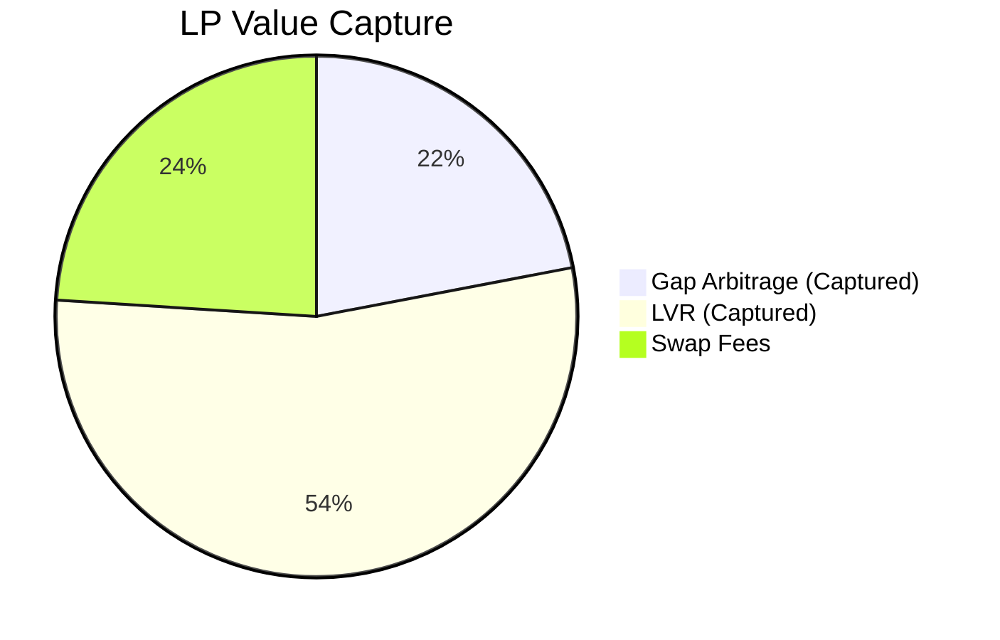

| Metric | Without StockShield | With StockShield |
|--------|:-------------------:|:----------------:|
| Gap Loss | -$32M | **+$22M** (captured) |
| LVR Loss | -$60M | **+$54M** (captured) |
| **Net Annual** | **-$92M** | **+$76M** |

---

## 🔐 Security Features

### Circuit Breaker System

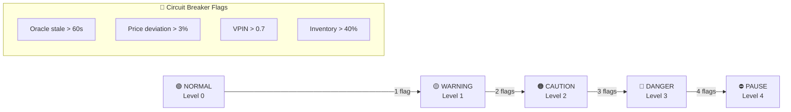

### Multi-Source Oracle Consensus

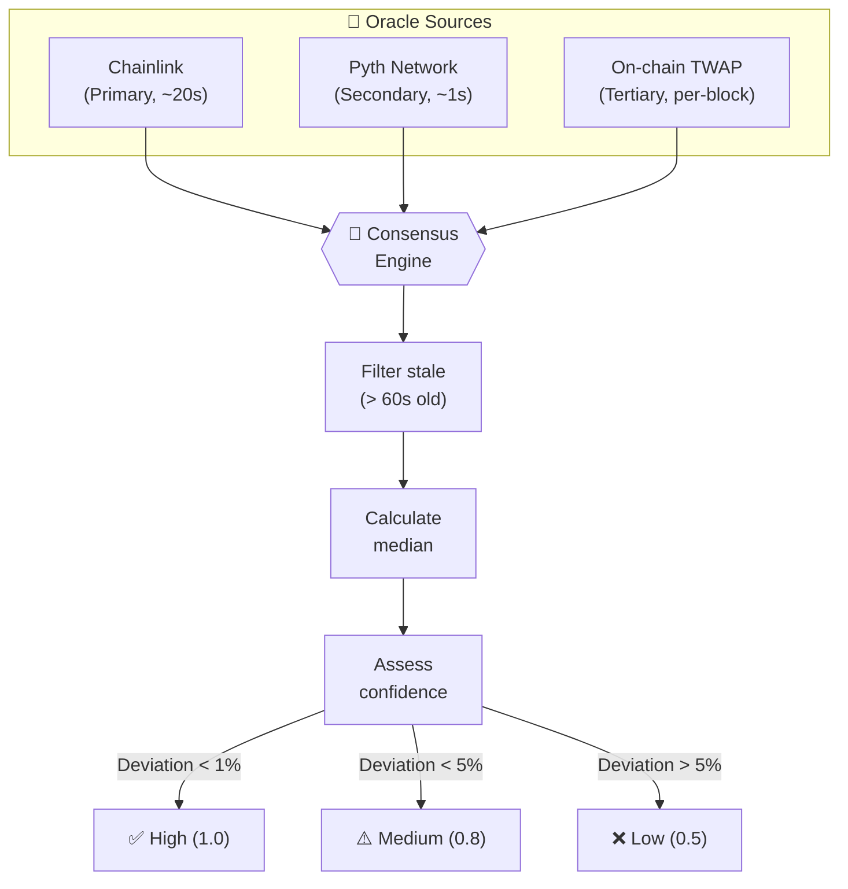

---

## 🚀 Quick Start

### Prerequisites

- [Foundry](https://book.getfoundry.sh/getting-started/installation)
- [Node.js](https://nodejs.org/) >= 18
- [pnpm](https://pnpm.io/) or npm

### Installation

```bash
# Clone the repository
git clone https://github.com/yourusername/stockshield.git
cd stockshield

# Install contract dependencies
cd contracts
forge install

# Install backend dependencies
cd ../backend
npm install
```

### Build & Test

```bash
# Build contracts
cd contracts
forge build

# Run tests
forge test

# Run tests with gas reporting
forge test --gas-report

# Format code
forge fmt
```

### Local Development

```bash
# Start local Ethereum node
anvil

# Deploy contracts (in another terminal)
forge script script/Deploy.s.sol --rpc-url http://localhost:8545 --private-key <key> --broadcast

# Start backend services
cd backend
npm run dev
```

---

## 📁 Project Structure

```
stockshield/
├── 📄 README.md              ← You are here
├── 📁 contracts/             ← Solidity smart contracts (Foundry)
│   ├── src/
│   │   ├── StockShieldHook.sol
│   │   ├── MarginVault.sol
│   │   ├── RegimeOracle.sol
│   │   ├── GapAuction.sol
│   │   └── StockShieldResolver.sol
│   ├── test/
│   └── script/
├── 📁 backend/               ← Off-chain services (TypeScript)
│   ├── src/
│   ├── oracle/               ← Oracle aggregation
│   ├── regime/               ← Market regime detection
│   └── clearnode/            ← Yellow Network integration
├── 📁 frontend/              ← Web interface
└── 📁 docs/                  ← Documentation
```

---

## 🏆 Prize Tracks

| Prize | Integration | Amount |
|-------|-------------|:------:|
| **Yellow Network** | Dual-mode auction engine on ClearNode | **$15K** |
| **Uniswap Foundation** | Market-hours aware v4 hook | **$5K** |
| **ENS** | Solver identity via subdomains | **$5K** |

---

## 🤝 Competitive Advantage

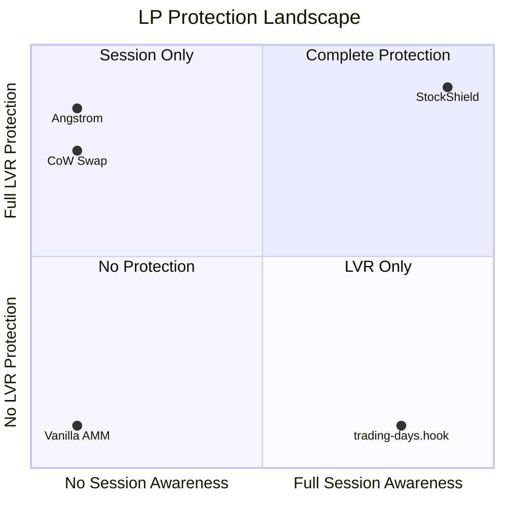

| Project | Session Gaps | Continuous LVR | Tokenized Focus |
|---------|:------------:|:--------------:|:---------------:|
| trading-days.hook | ✅ Blocks trades | ❌ | ❌ |
| CoW Swap | ❌ | ✅ Batch | ❌ |
| Angstrom | ❌ | ✅ Block | ❌ |
| **StockShield** | **✅ Gap capture (70%)** | **✅ Flash-Commit (90%)** | **✅** |

---

## 📚 Documentation

- 📖 [Whitepaper](./docs/whitepaper.pdf) — Comprehensive protocol specification
- 🔧 [Developer Handbook](./docs/developer-handbook.pdf) — Technical implementation guide
- 📐 [Math Formulas](./MATH_FORMULAS.md) — Fee and auction calculations
- 🎯 [Demo Strategy](./DEMO_STRATEGY.md) — Hackathon demo scenarios

---

## 🗺️ Roadmap

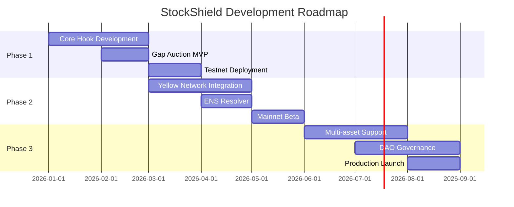

---

## 👥 Team

Built with ❤️ for [HackMoney 2026](https://hackmoney.xyz)

---

## 📄 License

This project is licensed under the MIT License — see the [LICENSE](LICENSE) file for details.

---

<p align="center">
  <strong>🛡️ StockShield Protocol — Protecting LPs in the Tokenized Securities Era</strong>
</p>

<p align="center">
  <a href="https://twitter.com/stockshield">Twitter</a> •
  <a href="https://discord.gg/stockshield">Discord</a> •
  <a href="https://stockshield.xyz">Website</a>
</p>
