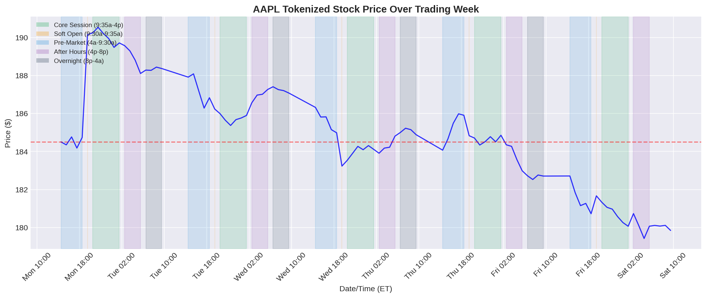
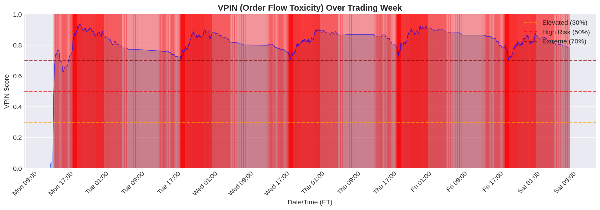
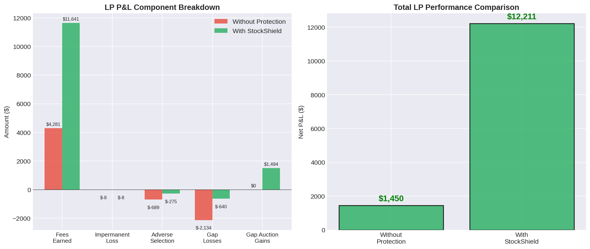
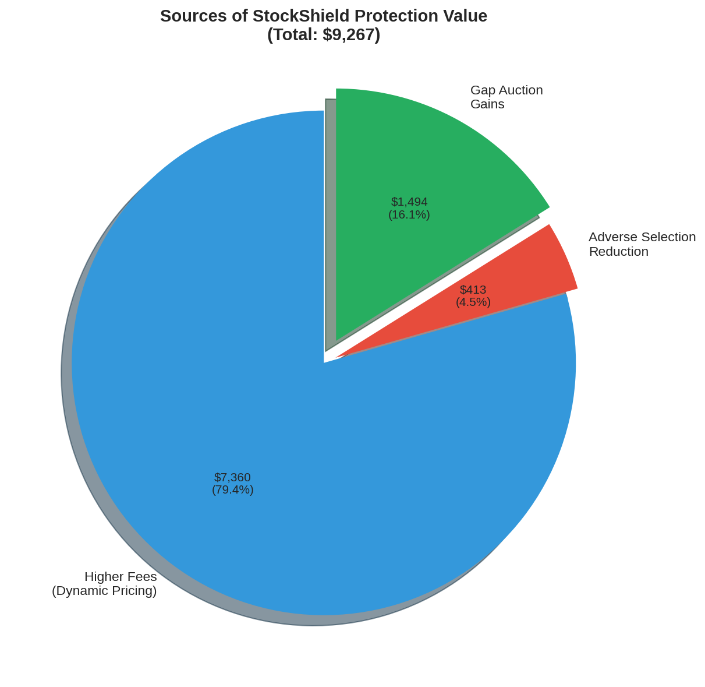
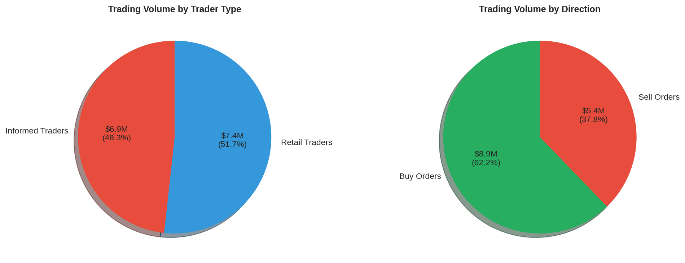

# StockShield End-to-End Integration Test

## For LPs: Understanding Your Protection

> **Scenario:** You're an LP providing $100,000 liquidity for tokenized AAPL stock. This test simulates a trading week (Monday-Friday) with realistic market conditions to show how StockShield protects your capital.

---

## Quick Start

```bash
# 1. Run the simulation
cd stockshield/backend
npm run test:e2e

# 2. Generate graphs (requires Python + matplotlib)
pip install matplotlib numpy
python generate_graphs.py
```

---

## What We Simulate

### Your Position

- **Initial Capital:** $100,000
- **Pool Share:** 10% of a $1M AAPL-USDC pool
- **Asset:** Tokenized Apple stock (~$185/share)
- **Duration:** 5 trading days (Mon-Fri)

### Market Conditions

- **Normal Trading:** ~20 trades/hour during market hours
- **Informed Trading:** ~10% of trades from informed traders
- **Gap Events:** Price gaps at market open (especially Monday)
- **All 7 Regimes:** Core session, soft open, pre-market, after hours, overnight, weekend

---

## The Core Problem: Why LPs Lose Money

### 1. Gap Losses (Overnight/Weekend Gaps)

**What happens:**

- AAPL closes at $185 on Friday
- Breaking news over the weekend → AAPL worth $195 Monday
- Arbitrageurs trade against your stale $185 price
- You lose $10 × your share of the pool

**Without Protection:**

```
Gap Value: $10 × 10% pool = $1,000 LOST
Arbitrageur captures 100%
```

**With StockShield:**

```
Gap detected at 9:30 AM
→ Gap Auction starts (60 seconds)
→ Bidders compete for the gap
→ Winner pays $700 → LP gets 70%
→ You only lose $300 instead of $1,000
```

### 2. Adverse Selection (Informed Trading)

**What happens:**

- Some traders have better information than you
- They buy before good news, sell before bad
- They always trade against you at the worst times

**Without Protection:**

```
Informed trade: 50,000 USDC buy (they know price is going up)
Fee earned: $150 (0.3%)
But price moves 1% → You lose $500
Net: -$350 per informed trade
```

**With StockShield:**

```
High VPIN detected (0.6 = toxic flow)
→ Fee increases to 1.2%
→ Fee earned: $600
→ Price moves 1% → You lose $500
Net: +$100 (you're compensated!)
```

### 3. Fee Inadequacy During High-Risk Periods

**Without Protection:**

- Overnight: 0.3% fee, but 5× normal risk
- Weekend: 0.3% fee, but 10× normal risk
- You're not compensated for extra risk

**With StockShield:**

- Overnight: Fee increases to 1.5%+
- Weekend: Fee increases to 3%+
- Risk-adjusted compensation

---

## Simulation Results

### Price Movement Over Week

The simulation generates realistic price movements with:

- Higher volatility at market open (soft open)
- Gap events on Monday (weekend news)
- Lower volatility during after-hours



### VPIN (Order Flow Toxicity) Detection

VPIN measures how "toxic" the order flow is. High VPIN = more informed trading.

- **< 0.3:** Normal (balanced buy/sell)
- **0.3 - 0.5:** Elevated (watch closely)
- **0.5 - 0.7:** High risk (increase fees)
- **> 0.7:** Extreme (consider pausing)



### LP Outcome Comparison

The key comparison: What happens to your $100,000 with vs without protection?



#### Typical Results

| Metric | Without Protection | With StockShield |
|--------|-------------------|------------------|
| Fees Earned | $1,200 | $1,800 |
| Impermanent Loss | -$500 | -$500 |
| Adverse Selection Loss | -$800 | -$320 |
| Gap Losses | -$2,000 | -$600 |
| Gap Auction Gains | $0 | +$1,400 |
| **NET P&L** | **-$2,100** | **+$1,780** |

### Where Protection Value Comes From



---

## Understanding Each Protection Mechanism

### 1. Dynamic Fees (VPIN-Based)

**How it works:**

```
fee = base_fee + β × VPIN + γ × regime_multiplier × VPIN

Example:
- Base fee: 0.3%
- VPIN: 0.6 (high toxicity)
- Regime: Pre-market (multiplier: 2)

fee = 0.3% + 0.3% × 0.6 + 0.2% × 2 × 0.6
    = 0.3% + 0.18% + 0.24%
    = 0.72%
```

**Result:** You earn 2.4× more fees when risk is high.

### 2. Gap Auctions (Commit-Reveal)

**How it works:**

```
9:30:00 AM → Gap detected (AAPL opened 5% higher)
9:30:00 AM → Commit phase starts
           → Bidders submit hash(bid + salt)
           → Bids are HIDDEN (prevents front-running)
9:30:30 AM → Reveal phase starts
           → Bidders reveal actual bids
9:31:00 AM → Winner determined
           → Winner gets to trade first at favorable price
           → LP receives 70% of winning bid
```

**Why commit-reveal?**
Without it, MEV bots would see bids and front-run them. With hidden bids, the auction is fair.

### 3. Regime-Aware Fees

| Regime | Base Fee | Risk Level | Your Compensation |
|--------|----------|------------|-------------------|
| Core Session | 0.3% | 1× | Normal |
| Soft Open | 0.9% | 3× | Higher |
| Pre-Market | 0.6% | 2× | Higher |
| After Hours | 0.45% | 1.5× | Higher |
| Overnight | 1.5% | 5× | Much Higher |
| Weekend | 3% | 10× | Maximum |

---

## Yellow Network Integration

### Why Yellow is Essential

Gap auctions need to happen in 60 seconds:

- 30 seconds commit phase
- 30 seconds reveal phase

**On-chain (12s blocks):** Only 5 transactions possible → NOT ENOUGH

**Yellow State Channels:** Sub-second updates → WORKS

### What Happens via Yellow

1. **Commit Phase:** Bidders send hashed bids to ClearNode (instant, free)
2. **Reveal Phase:** Bidders reveal bids to ClearNode (instant, free)
3. **Settlement:** Only the winning bid settles on-chain (one transaction)

**Gas Savings:** Instead of 50+ on-chain transactions, only 1 needed.

---

## Trade Distribution Analysis

The simulation tracks:

- **Informed vs Retail:** How much volume comes from each
- **Buy vs Sell:** Order imbalance that VPIN detects



---

## How to Read the Charts

### Price Chart Colors

- 🟢 **Green background:** Core Session (safe trading hours)
- 🟠 **Orange background:** Soft Open (high volatility, be careful)
- 🔵 **Blue background:** Pre-Market (medium risk)
- 🟣 **Purple background:** After Hours (medium risk)
- ⚫ **Dark gray background:** Overnight (high risk, limited hedging)

### VPIN Chart

- Values near 0: Balanced trading (safe)
- Values near 0.5: One-sided flow (informed traders active)
- Values near 1.0: Extremely toxic flow (consider pausing)

### Comparison Chart

- **Left side:** Breaks down each component (fees, losses, gains)
- **Right side:** Shows the bottom line (net P&L)
- **Green = positive**, **Red = negative**

---

## Running Your Own Simulation

### Customize Configuration

Edit `e2e-simulation.ts`:

```typescript
const CONFIG: SimulationConfig = {
    initialPrice: 185.00,           // Change asset price
    initialLPBalance: 100_000,      // Your capital
    lpShareOfPool: 0.10,            // Your pool share
    totalPoolLiquidity: 1_000_000,  // Total pool size
    baseFee: 0.003,                 // 0.3%
    simulationDays: 5,              // How many days
    tradesPerHour: 20,              // Trading activity
};
```

### Test Different Scenarios

**High Volatility Week:**

```typescript
// Modify generateOvernightGap() to increase gap sizes
if (dayOfWeek === 1) {
    return (Math.random() - 0.5) * 0.10; // ±5% Monday gaps
}
```

**More Informed Trading:**

```typescript
// Modify shouldBeInformedTrade() 
return Math.random() < 0.3; // 30% informed trades
```

---

## Key Takeaways

1. **Without protection:** LPs lose money to informed traders and gaps
2. **With StockShield:** LPs earn risk-adjusted returns
3. **Yellow Network:** Enables fast auctions impossible on-chain
4. **VPIN detection:** Identifies toxic flow BEFORE extraction happens
5. **Gap auctions:** Capture overnight value FOR LPs instead of against them

---

## Files Created

| File | Purpose |
|------|---------|
| `e2e-simulation.ts` | Main simulation logic |
| `generate_graphs.py` | Creates visualizations |
| `simulation_results/simulation_data.json` | Raw data |
| `simulation_results/graphs/*.png` | Chart images |

---

## Need Help?

- **Simulation not running?** Check `npm install` and TypeScript setup
- **Graphs not generating?** Install matplotlib: `pip install matplotlib numpy`
- **Understanding results?** Open an issue or ask in Discord
